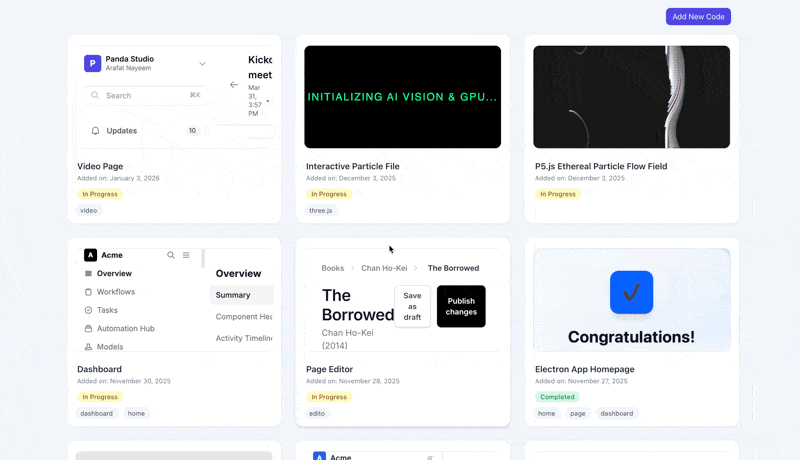

<p align="center">
  <a href="https://github.com/stephen-costa20/Templatron"></a>
  <a href="https://github.com/stephen-costa20/Templatron/blob/main/LICENSE"></a>
  <a href="https://github.com/stephen-costa20/Templatron/commits/main"></a>
  
</p>


# ⭐ Templatron - HTML Template Library

A Django backend + admin-friendly UI for storing, tagging, and managing HTML/UI components (“templates”), including file attachments. Designed as a practical building block for a larger internal tools system (component catalogs, UI libraries, doc-style apps).

## Screenshot



## Features

### Component Library + Catalog
- **Centralized component registry** for reusable HTML/UI snippets
- Store rich metadata per component, including:
  - **Name / title**
  - **Section / category** (for grouping and navigation)
  - **Tags** (for quick filtering and search)
  - **Status** (e.g., draft/active/archived — depending on your workflow)
  - **Notes, usage guidance, and implementation instructions**
- Designed to keep UI building blocks organized so you can reuse patterns across projects without re-inventing layouts.

### Live Preview (Rendered Output)
- **Run-and-view preview** of saved component code directly in the UI
- Enables quick validation of:
  - layout and spacing
  - typography
  - component structure
  - “does this actually render correctly?”
- Makes the library practical for day-to-day use (you’re not just storing code—you’re storing **working UI**).

### Copy / Paste Ready Code
- One-click (or quick) ability to **copy component code** for use elsewhere
- Supports workflows like:
  - copy into a Django template
  - paste into a static HTML prototype
  - reuse in another app/module
- Encourages “component reuse” in real projects instead of hunting through old files.

### File Uploads + Attachments
- Upload and attach files to a component (e.g.):
  - images/icons used by the component
  - sample documents
  - JSON payload examples
  - style references
  - additional supporting assets
- Keeps component code and supporting resources bundled together so reuse is frictionless.

### UI Designed for Fast Browsing and Retrieval
- Optimized for the “I need that snippet again” workflow:
  - browse by section
  - filter by tags/status
  - open a component and immediately view preview + code
- Treats components like a library, not a dumping ground.

### Extensible Data Model
- Structured to support future features without major refactors, such as:
  - versioning (track edits and restore prior versions) (work in progress)

### Developer-Friendly Local Setup
- Runs locally with standard Django workflow:
  - `makemigrations` / `migrate`
  - `runserver`


## Quickstart (Local Development)

### 1. Create and activate a virtual environment
```bash
python -m venv .venv
source .venv/bin/activate   # macOS/Linux
.venv\Scripts\activate    # Windows
```

### 2. Install dependencies 
```bash
pip install -r requirements.txt
```

### 3. Configure environment variables
```bash
cp .env.example .env
```

### 4. Run database migrations
```bash
python manage.py makemigrations
python manage.py migrate
```

### 5. Start the development server
```bash
python manage.py runserver
Open: http://127.0.0.1:8000/
```

Alternatively, you can use the provided Makefile:

```bash
make setup
make run
```
